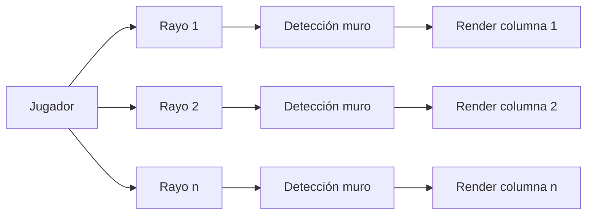

# 🕹️ Cub3D – Proyecto 42 (Versión Extendida)

> *"No estás construyendo un simple juego, estás programando tu propio motor 3D desde cero."*

---

## 🧭 Sobre el Proyecto

**Cub3D** es un proyecto del cursus de **42** inspirado en *Wolfenstein 3D (1992)*.  
El objetivo es crear un **motor gráfico en primera persona** utilizando la técnica de **raycasting**, representando un entorno 3D dentro de una ventana 2D.  

Esta versión extendida añade características avanzadas:  
- 🔹 Soporte completo para **ratón** (rotación suave).  
- 🔹 **Minimapa dinámico** con escala ajustable.  
- 🔹 **Texturas personalizadas** (piezas de ajedrez, madera, ladrillo, mármol, etc.).  
- 🔹 **Gestión robusta del archivo `.cub`** (validaciones, RGB, formato flexible).  
- 🔹 **Raycasting texturizado** con DDA optimizado.  
- 🔹 **Eventos del teclado y ratón** integrados con la MiniLibX de Linux.  

---

## ✨ Objetivos del Proyecto

- Comprender los fundamentos del **renderizado en 3D** usando raycasting.  
- Implementar un **parsing robusto** para leer archivos `.cub`.  
- Dominar el manejo de **eventos gráficos** (teclado, ratón, cierre de ventana).  
- Aprender a **optimizar operaciones matemáticas** en C.  
- Aplicar **estructuras de datos, punteros y control de memoria** en un entorno visual.  

---

## ⚙️ Compilación y Ejecución

### 🔧 Requisitos
```bash
sudo apt-get install gcc make xorg libxext-dev libbsd-dev
```

### 🧱 Compilar el proyecto
```bash
make
```

### ▶️ Ejecutar con un mapa
```bash
./cub3D maps/map1.cub
```

### 🧹 Comandos útiles
```bash
make clean     # Borra archivos objeto
make fclean    # Limpia binarios y librerías
make re        # Recompila desde cero
```

---

## 🎮 Controles

| Acción | Tecla / Ratón |
|--------|----------------|
| Mover hacia adelante | `W` |
| Mover hacia atrás | `S` |
| Desplazarse a la izquierda | `A` |
| Desplazarse a la derecha | `D` |
| Girar cámara | `←` / `→` |
| Rotar con ratón | Movimiento horizontal |
| Cerrar el juego | `ESC` o clic en la X |

---

## 🧩 Estructura General del Motor

El motor de Cub3D sigue un **pipeline modular**:  
1. **Parsing** → Lectura del mapa `.cub`, validaciones y carga de texturas.  
2. **Inicialización** → Carga de MLX, creación de ventana y estructuras base.  
3. **Raycasting** → Cálculo de rayos, detección de colisiones y proyección.  
4. **Renderizado** → Dibujo de columnas texturizadas en pantalla.  
5. **Input Loop** → Control de movimiento y rotación.  
6. **Minimapa** → Renderizado auxiliar en 2D.  

---

### 🧠 Diagrama general del flujo

```
graph TD
    A[Inicio] --> B[Leer archivo .cub]
    B --> C[Validar texturas y mapa]
    C --> D[Inicializar estructuras y MLX]
    D --> E[Loop del juego]
    E --> F[Raycasting (DDA)]
    F --> G[Renderizar frame]
    G --> H[Actualizar minimapa]
    H --> I[Capturar input (teclado/ratón)]
    I --> E
    E --> J[Salir del juego]
```

---

## 🗺️ Formato del Archivo `.cub`

Cada archivo `.cub` define el entorno, texturas, colores y mapa:

```
NO ./text/greystone.xpm
SO ./text/bluestone.xpm
WE ./text/wood.xpm
EA ./text/mossy.xpm
F 220,100,0
C 225,30,0

1111111
1000001
100N001
1111111
```

### Elementos admitidos
| Clave | Descripción |
|--------|-------------|
| `NO`, `SO`, `WE`, `EA` | Rutas a texturas `.xpm` |
| `F` / `C` | Colores del suelo y techo (RGB) |
| `1` | Muro |
| `0` | Espacio vacío |
| `N/S/E/W` | Jugador y orientación inicial |

### Validaciones implementadas
- ✅ Solo un jugador permitido.  
- ✅ Mapa completamente cerrado por muros.  
- ✅ Formato de RGB válido (0–255).  
- ✅ Rutas de texturas existentes.  
- ✅ Permite líneas vacías y orden flexible.

---

## 🌈 Sistema de Raycasting (Render 3D)

El motor utiliza el algoritmo **DDA (Digital Differential Analyzer)** para trazar rayos y detectar colisiones con muros.

### 🔹 Etapas del proceso:
1. Calcular dirección del rayo por píxel (`rayDirX`, `rayDirY`).  
2. Calcular incrementos `deltaX`, `deltaY`.  
3. Avanzar por el mapa (`mapX`, `mapY`) hasta colisionar con `1`.  
4. Determinar distancia perpendicular al muro.  
5. Dibujar columna vertical proporcional a la distancia.  
6. Aplicar textura en función del punto de impacto.  



---

### 🔧 Principales archivos del render
| Archivo | Descripción |
|----------|--------------|
| `raycasting.c` | Cálculo de DDA y distancias |
| `draw_textures.c` | Aplicación de texturas en columnas |
| `draw_frame.c` | Bucle principal de renderizado |
| `load_texture.c` | Carga imágenes `.xpm` en memoria |

---

## 🧭 Minimap (Bonus)

- Representación 2D del entorno.  
- Escala ajustable según tamaño de la ventana (`MINIMAP_PERCENTAGE`).  
- Dibuja:  
  - 🟥 Jugador  
  - 🟦 Muros  
  - ⬜ Espacios libres  
- Actualización en tiempo real.

---

## 🖱️ Sistema de Inputs

- **Teclado:** `mlx_hook(2, 1L<<0, key_press, ...)` / `mlx_hook(3, 1L<<1, key_release, ...)`.  
- **Ratón:** rotación dinámica con `mlx_hook(6, 1L<<6, handle_mouse_move, ...)`.  
- **Cierre del juego:** evento `DestroyNotify (17)`.

---

## 🧩 Estructuras Clave

```c
typedef struct s_player {
    double x, y;
    double dir_x, dir_y;
    double plane_x, plane_y;
}   t_player;

typedef struct s_texture {
    void *img;
    int *addr;
    int width, height;
}   t_texture;

typedef struct s_ray {
    double dir_x, dir_y;
    int map_x, map_y;
    double side_x, side_y;
    double delta_x, delta_y;
}   t_ray;

typedef struct s_data {
    void *mlx;
    void *win;
    t_player player;
    t_texture tex[4];
    char **map;
}   t_data;
```

---

## 📊 Estructura del Proyecto

```bash
Cub3D/
├── Makefile
├── cub3d.h
├── libft/
│   ├── ft_split.c
│   ├── get_next_line.c
│   └── ...
├── minilibx-linux/
│   ├── mlx.h
│   └── ...
├── src/
│   ├── parse/        # Lectura y validación del .cub
│   ├── render/       # DDA, texturas y proyección
│   ├── game/         # Inputs, loop principal y minimapa
│   ├── utils.c       # Funciones auxiliares
│   └── main.c
├── maps/
│   ├── map1.cub
│   ├── map2.cub
│   └── ...
└── text/
    ├── wood.xpm
    ├── bluestone.xpm
    ├── greystone.xpm
    ├── piezas_ajedrez.xpm
    └── ...
```

---

## 🧪 Ejemplo de Ejecución

```
$ ./cub3D maps/map1.cub

Cargando texturas...
Iniciando raycasting...
Renderizando mapa: 64x64 celdas
Presiona ESC para salir.
```

---

## ✅ Cumplimiento de Normas 42

| Requisito | Estado |
|------------|--------|
| Norminette | ✅ Sin errores |
| Leaks | ✅ Comprobado con Valgrind |
| MLX | ✅ Compatible Linux |
| Parsing | ✅ Robusto y validado |
| Bonus | ✅ Minimap y ratón funcionales |

---

## 📚 Recursos y Créditos

- [MiniLibX Linux](https://github.com/42Paris/minilibx-linux)  
- [Libft – 42 Library](https://github.com/42Paris/libft)  
- Raycasting references:
  - *Lodev Raycasting Tutorial*
  - *Permadi: Understanding Raycasting*
- Inspiración visual: *Wolfenstein 3D (id Software, 1992)*  

---

## 🧾 Conclusión

El proyecto **Cub3D** transforma los fundamentos teóricos de C en una aplicación visual compleja.  
Permite comprender cómo se combinan **matemáticas, estructuras, memoria y gráficos** para construir un motor 3D funcional.  

> “Después de Cub3D, mirarás cualquier juego 3D de otra forma.  
> Porque sabrás exactamente qué pasa detrás de cada píxel.”
